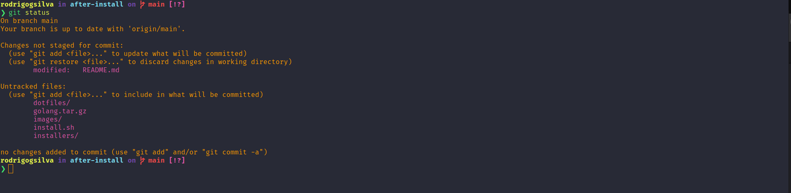

[![Contributors][contributors-shield]][contributors-url]
[![Forks][forks-shield]][forks-url]
[![Stargazers][stars-shield]][stars-url]
[![Issues][issues-shield]][issues-url]
[![MIT License][license-shield]][license-url]
[![LinkedIn][linkedin-shield]][linkedin-url]

<!-- PROJECT LOGO -->
<br />
<p align="center">
  <a href="https://github.com/rodrigogsilva/after-install">
    
  </a>

  <h3 align="center">My ubuntu system after install</h3>

  <p align="center">
    This projects is basically a script to install everything I need after format my ubuntu machine.<br/>
Feel free to change and use it as you like!
    <br />
    <br />
    <a href="https://github.com/rodrigogsilva/after-install/issues">Report Bug</a>
    ·
    <a href="https://github.com/rodrigogsilva/after-install/issues">Request Feature</a>
  </p>
</p>

<!-- TABLE OF CONTENTS -->
<details open="open">
  <summary><h2 style="display: inline-block">Table of Contents</h2></summary>
  <ol>
    <li>
      <a href="#about-the-project">About The Project</a>
    </li>
    <li>
      <a href="#getting-started">Getting Started</a>
      <ul>
        <li><a href="#installation">Installation</a></li>
      </ul>
    </li>
    <li><a href="#usage">Usage</a></li>
    <li><a href="#roadmap">Roadmap</a></li>
    <li><a href="#contributing">Contributing</a></li>
    <li><a href="#license">License</a></li>
    <li><a href="#contact">Contact</a></li>
    <li><a href="#acknowledgements">Acknowledgements</a></li>
  </ol>
</details>

<!-- ABOUT THE PROJECT -->

## About The Project

[![Product Name Screen Shot][product-screenshot]](https://github.com/rodrigogsilva/after-install/blob/master/images/logo.png)

<!-- GETTING STARTED -->

## Getting Started

To get a local copy up and running follow these simple steps.

### Installation

```sh
git clone https://github.com/rodrigogsilva/after-install.git
cd after-install
sudo bash install.sh
```

<!-- USAGE EXAMPLES -->

## Usage

Just run the install.sh and it will run the installers inside the "installers" folder

<!-- ROADMAP -->

## Roadmap

See the [open issues](https://github.com/rodrigogsilva/after-install/issues) for a list of proposed features (and known issues).

<!-- CONTRIBUTING -->

## Contributing

Contributions are what make the open source community such an amazing place to be learn, inspire, and create. Any contributions you make are **greatly appreciated**.

1. Fork the Project
2. Create your Feature Branch (`git checkout -b feature/AmazingFeature`)
3. Commit your Changes (`git commit -m 'Add some AmazingFeature'`)
4. Push to the Branch (`git push origin feature/AmazingFeature`)
5. Open a Pull Request

<!-- LICENSE -->

## License

Distributed under the MIT License. See `LICENSE` for more information.

<!-- CONTACT -->

## Contact

Rodrigo Gonçalves da Silva - rodrigogoncalveess@gmail.com

Project Link: [https://github.com/rodrigogsilva/after-install](https://github.com/rodrigogsilva/after-install)

<!-- ACKNOWLEDGEMENTS -->

## Acknowledgements

- [mathiasbynens/dotfiles](https://github.com/mathiasbynens/dotfiles)
- [Best-README-Template](https://github.com/othneildrew/Best-README-Template)

<!-- MARKDOWN LINKS & IMAGES -->
<!-- https://www.markdownguide.org/basic-syntax/#reference-style-links -->

[contributors-shield]: https://img.shields.io/github/contributors/rodrigogsilva/after-install.svg?style=for-the-badge
[contributors-url]: https://github.com/rodrigogsilva/after-install/graphs/contributors
[forks-shield]: https://img.shields.io/github/forks/rodrigogsilva/after-install.svg?style=for-the-badge
[forks-url]: https://github.com/rodrigogsilva/after-install/network/members
[stars-shield]: https://img.shields.io/github/stars/rodrigogsilva/after-install.svg?style=for-the-badge
[stars-url]: https://github.com/rodrigogsilva/after-install/stargazers
[issues-shield]: https://img.shields.io/github/issues/rodrigogsilva/after-install.svg?style=for-the-badge
[issues-url]: https://github.com/rodrigogsilva/after-install/issues
[license-shield]: https://img.shields.io/github/license/rodrigogsilva/after-install.svg?style=for-the-badge
[license-url]: https://github.com/rodrigogsilva/after-install/blob/main/LICENSE
[linkedin-shield]: https://img.shields.io/badge/-LinkedIn-black.svg?style=for-the-badge&logo=linkedin&colorB=555
[linkedin-url]: https://linkedin.com/in/rodrigogsilva
